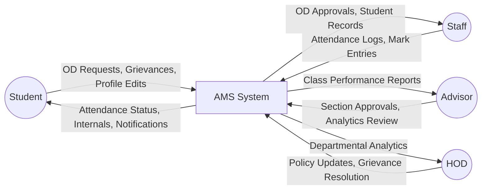
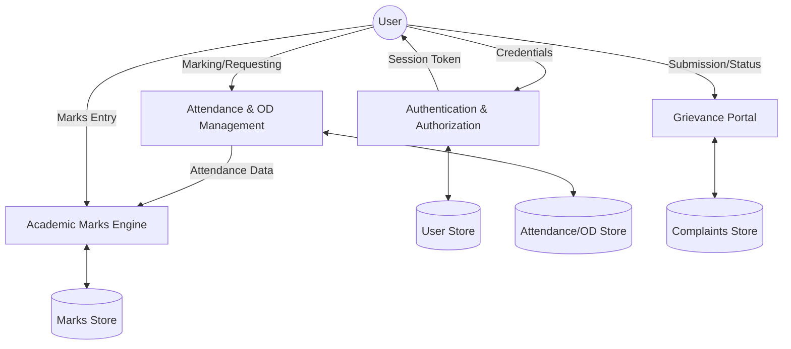
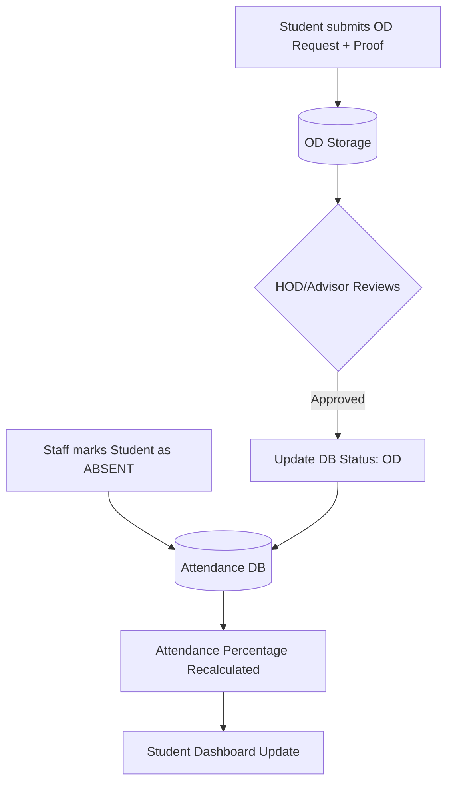
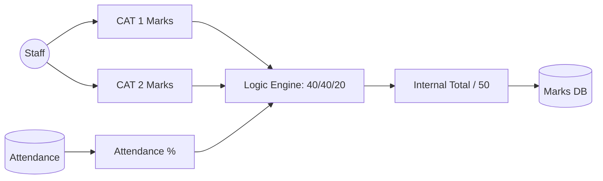
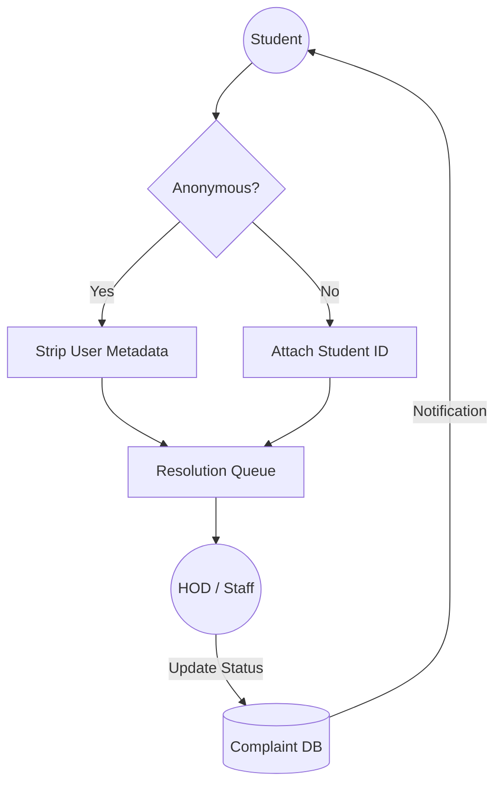

# 📊 AMS: Detailed Data Flow Diagrams (DFD)

This document provides a granular view of how data moves through the Academic Management System (AMS) for every key module.

## 1. Level 0: Context Diagram
The Context Diagram shows the system as a single process interacting with external entities.

---

## 2. Level 1: Core Process Migration
Detailed view of internal system processes and data stores.

---

## 3. Level 2: Sub-Process Details

### **3.1 Attendance & OD Lifecycle**
How student presence and "On-Duty" requests are synchronized.

### **3.2 Academic Marks & Analytics Flow**
The logic behind weighted internal calculations.

### **3.3 Grievance Redressal (Privacy Flow)**
Data flow for identified vs. anonymous complaints.

---

## 4. Data Dictionary (Key Flows)

| Flow Name | Description | Source Process | Destination Process | Data Elements |
| :--- | :--- | :--- | :--- | :--- |
| **Auth Request** | User login attempt | Login Form | Auth Service | Email, Password |
| **Attendance Sync** | Real-time presence update | Staff List | DB & Stud. Dashboard | StudentID, Status, Date |
| **OD Payload** | "On-Duty" application data | OD Form | Staff Reviewer | Dates, Reason, Proof Image |
| **Internal Grade** | Final calculated mark | Calculation Logic | Marks Table | CAT1, CAT2, AttdScore, Total |
| **Grievance Pkt** | Submitted complaint | Complaint Form | Resolution Process | Category, Text, Meta(Optional) |
