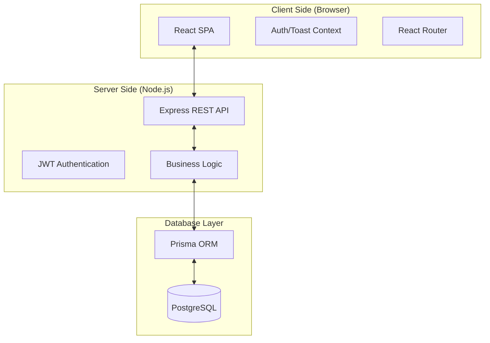

# 🏗️ AMS: System Architecture & Data Flow

## 1. System Architecture
The Academic Management System (AMS) is built on a modern **three-tier architecture**, ensuring scalability, security, and a high-performance user experience.

### **Architecture Layers**
1.  **Presentation Layer (Frontend)**:
    *   **Technologies:** React 18, Vite, Tailwind CSS, Lucide Icons, Framer Motion.
    *   **Responsibilities:** User Interface rendering, State Management (React Context), Client-side Routing, Mock Data Handling (Alpha stage), and Responsive Design.
2.  **Logic Layer (Backend)**:
    *   **Technologies:** Node.js, Express.js.
    *   **Responsibilities:** RESTful API Endpoints, Role-Based Access Control (RBAC) Middleware, Business Logic for Attendance/Marks, and Notification Dispatching.
3.  **Data Layer (Storage)**:
    *   **Technologies:** PostgreSQL, Prisma ORM.
    *   **Responsibilities:** Persistent storage of user profiles, attendance logs, academic records, and encrypted grievance data.

---

## 2. Component Diagram

---

## 3. Data Flow Diagram (DFD)

### **Level 0: Context Diagram**
The system acts as a centralized hub for all academic stakeholders.
*   **Students:** Provide OD requests and Grievances; Receive Attendance and Marks data.
*   **Staff:** Provide Attendance logs and Mark entries; Receive OD approvals.
*   **HOD/Advisor:** Provide Approvals and Resolutions; Receive Analytics and Reports.

### **Level 1: Process Flow**
1.  **Authentication Flow**: 
    `User Credentials` -> `Auth Middleware` -> `JWT Token` -> `Role-specific Redirect`.
2.  **Attendance Flow**: 
    `Staff Input` -> `Attendance Service` -> `Database Sync` -> `Student Dashboard Update`.
3.  **OD Request Flow**: 
    `Student Upload` -> `File Storage/DB` -> `Staff Notification` -> `Approval/Rejection Logic` -> `Attendance Correction`.
4.  **Academic Marks Flow**: 
    `Staff Entry` -> `Formula Logic (CAT1+CAT2+Attd)` -> `Marks Table` -> `GPA Calculation` -> `Analytics Engine`.

---

## 4. Entity Relationship (Internal Data Flow)
| Entity | Flow Source | Flow Destination | Key Attributes |
| :--- | :--- | :--- | :--- |
| **User** | Auth Service | All Components | ID, Email, Role, Name |
| **Attendance** | Staff Dashboard | Student Progress | Date, Status, SubjectID |
| **ODRequest** | Student Portal | Staff OD Manager | From/To Date, Proof, Status |
| **Marks** | Staff Entry | Analytics/GPA | CAT1, CAT2, InternalTotal |
| **Complaint** | Grievance Portal | HOD Dashboard | Category, Description, Status |

---

## 5. Security & Exception Flow
*   **Data Integrity:** Prisma Schema enforces relational constraints (e.g., Attendance cannot exist without a valid User ID).
*   **Connectivity:** Frontend interceptors check for `navigator.onLine` before executing write operations.
*   **Access Control:** `ProtectedRoute` component intercepts unauthorized path attempts based on the JWT payload.
